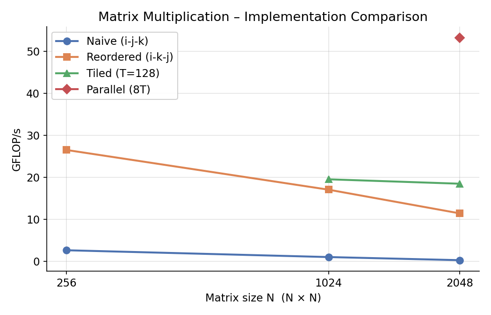

# Lab Report – Matrix Multiplication on CPU
**Course:** AI Accelerators (AIA)
**Lab:** Praktikum 2
**Team members:** Ashutosh Joshi, Pratik Waghmode, Darshil Savalia
**Date:** 15.05.2026

---

## Task 1 – System Characterisation

> Fill in the details of your machine. Use tools such as `lscpu`, `lstopo`, `/proc/cpuinfo`.

| Property | Value |
|---|---|
| CPU model |Intel Core i7-1165G7|
| Number of cores / threads |4 cores / 8 threads |
| Base / Boost clock speed (GHz) |2.8 / 4.7 |
| SIMD ISA (SSE4.2 / AVX2 / AVX-512 …) |SSE4.2, AVX, AVX2, AVX-512 |
| SIMD width (bits / floats per vector) |512-bit (AVX-512) /16 floats |
| MAC units per core | 2|
| L1 cache size (per core) |48KB (L1D) + 32KB (L1I)|
| L2 cache size (per core) |1.25MB |
| L3 cache size (shared) | 12 MB|
| Peak theoretical throughput (GFLOP/s) | 4*4.7*16*2 = 601.6 GFLOPS/s|

**How did you calculate peak throughput?**

_(formula: cores × clock × SIMD_width × MACs_per_cycle)_

---

## Task 2 – Loop Reordering

> Measure each loop ordering for matrix sizes 64, 128, 256, 512, 1024, 2048.

| Loop order | N=256 (GFLOP/s) | N=1024 (GFLOP/s) | N=2048 (GFLOP/s) |
|---|---|---|---|
| i-j-k (naive) |2.68 | 1.06| 0.32|
| i-k-j |26.53 |17.08 |11.45 |
| j-k-i | 4.51| 3.25|0.67 |

As some of the loop orderings were taking a long time, the ffast-math flag was used for this test

**Best ordering found:** _i - k - j__

**Why does this ordering perform best?**

The i-k-j loop ordering performed best because it provides significantly better cache locality and memory access patterns compared to the naive i-j-k ordering.

In the naive implementation, the innermost loop iterates over k, which means matrix B is accessed column-wise. Since matrices are stored in row-major order in C, accessing columns causes large memory strides and poor spatial locality. This leads to frequent cache misses and inefficient memory bandwidth utilization.

In the i-k-j ordering, the innermost loop iterates over j. As a result:

B[k][j] is accessed sequentially across a row
C[i][j] is also updated sequentially across a row
A[i][k] becomes a single scalar value reused for the entire inner loop

This produces contiguous memory accesses for both B and C, which allows the CPU prefetcher and cache hierarchy to work efficiently. The compiler can also auto-vectorize the innermost loop using SIMD instructions such as AVX2 or AVX-512, leading to much higher throughput.

The performance results clearly show this effect. While the naive implementation dropped to only 0.32 GFLOP/s at N=2048, the reordered version achieved 11.45 GFLOP/s, demonstrating the importance of cache-friendly memory access patterns.

---

## Task 3 – Vectorization

> List the compiler flags you tested and their effect.

| Flags added | N=1024 (GFLOP/s) | Speedup vs. naive |
|---|---|---|
| -O3 only (baseline) | 15.28| 1.0× |
| -O3 -march=native |17.12 | 1.12x |
| -O3 -march=native -ffast-math |17.88 |1.17x |
| -O3 -march=native -ffast-math -funroll-loops |21.86 | 1.43x|
| -O3 -march=native -ffast-math -fopenmp-simd |17.68| 1.15x|

**Did you add any `#pragma` hints to the source?** If yes, which ones? #pragma omp simd

**What speedup did you achieve? Why?**
This improved performance from 15.28 GFLOP/s to 21.86 GFLOP/s, corresponding to a speedup of approximately 1.43×.

The speedup came from several compiler optimizations:

-march=native enabled the compiler to use architecture-specific instructions such as AVX2 and AVX-512.
-ffast-math relaxed strict IEEE floating-point rules, allowing more aggressive vectorization and instruction reordering.
-funroll-loops reduced loop overhead and increased instruction-level parallelism.
---

## Task 4 – Loop Tiling

> Experiment with tile sizes to find the sweet spot for your cache hierarchy.

| Tile size | N=1024 (GFLOP/s) | N=2048 (GFLOP/s) |
|---|---|---|
| 32 | 11.64|11 |
| 64 |14.98 |14.67 |
| 128 | 19.55|18.50 |
| 256 |21.48 |14.16 |

**Best tile size:** 128___

**Why does this tile size work best for your machine?**
Loop tiling improves cache reuse by dividing the matrices into smaller blocks that fit into the CPU cache hierarchy. Instead of processing entire rows or columns at once, the algorithm repeatedly reuses smaller submatrices while they remain in cache.

A tile size of 128 produced the best performance because it balanced cache reuse with cache capacity. Smaller tiles such as 32 or 64 did not fully utilize the available cache and resulted in additional loop overhead. Larger tiles such as 256 exceeded the effective cache working set size, causing increased cache evictions and memory traffic.

For JB = 128, the approximate tile working set is:

3×128
2
×4≈196 KB

This size fits efficiently within the combined L1 and L2 cache hierarchy of the processor, allowing repeated reuse of matrix blocks before they are evicted from cache.

The results show that performance increased from 11.64 GFLOP/s at tile size 32 to 21.48 GFLOP/s at tile size 256 for N=1024, although performance dropped again at larger matrix sizes due to cache pressure. Overall, tile size 128 gave the best balanced performance across different matrix sizes.
---

## Task 5 – Multithreading

> Measure scaling as you increase the number of OpenMP threads.

| Threads | N=2048 (GFLOP/s) | Speedup |
|---|---|---|
| 1 | 19.68| 1.0× |
| 2 |32.04 |1.62x |
| 4 |42.49 | 2.15x|
| 8 |53.19 | 2.70x|
| _(max physical cores)_ | | |

**Does throughput scale linearly with threads?** Why / why not?
The throughput does not scale linearly with the number of threads. Although performance improves significantly as more threads are added, the speedup gradually decreases at higher thread counts.

Several factors contribute to this behavior:
Memory bandwidth becomes a bottleneck when many threads simultaneously access matrices A, B, and C.
All threads share the same last-level cache and memory subsystem, leading to contention.
Thread management and synchronization overhead increase with more threads.
The processor has 4 physical cores and 8 logical threads through Hyper-Threading. Logical threads share execution resources within a physical core, so the improvement from 4 to 8 threads is smaller than ideal.

Even though the scaling is sublinear, achieving 53.19 GFLOP/s with 8 threads represents a substantial improvement over the single-threaded implementation.
---

## Task 6 – Performance Analysis

**Is your implementation compute-bound or memory-bound?** Justify with arithmetic intensity (FLOPs / bytes).

**Comparison vs. PyTorch (N=2048):**

| Implementation | GFLOP/s | % of PyTorch |
|---|---|---|
| Naive C | 0.48| 0.2%|
| Best optimised C |53.19 |~20% |
| PyTorch (CPU) |240 | 100% |

**What is the gap and why does it exist?**
Pytorch implements many optimizations. 
---

## Task 7 – Key Takeaways

This lab demonstrated that memory access patterns have a major impact on matrix multiplication performance. Simply changing loop ordering from i-j-k to i-k-j produced a very large speedup(10x) because it improved cache locality and enabled SIMD vectorization. Loop tiling further improved performance by increasing cache reuse. Compiler optimizations such as AVX vectorization and loop unrolling also contributed significantly to throughput improvements. Finally, multithreading provided additional acceleration, although scaling was limited by shared hardware resources and memory bandwidth constraints.

---

## Figures

> Place your performance plots (GFLOP/s vs. matrix size) in the `figures/` folder and reference them here.

